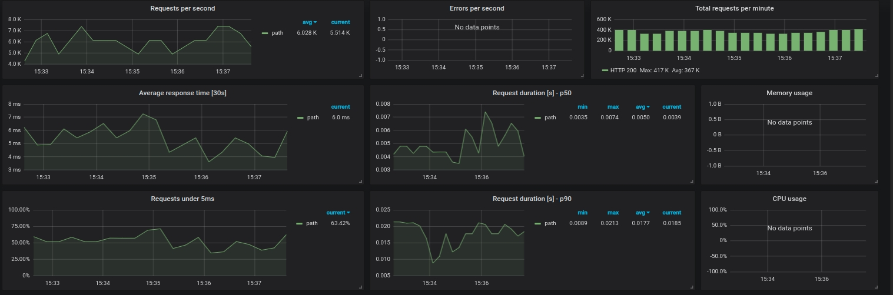

# Разработка ML микросервиса

## Задача от заказчика:
Есть модель разработанная DS специалистом. Ее необходимо превратить в веб-сервис, который будет встроен в работу 
боевой системы, взаимодействие предполагается через REST API. В сторону сервиса будет направляться массив данных 
(как указано в тестовых данных), а в ответ сервис должен возвращать ответ из функции pick_regno. Сервис будет встроен 
в боевую, высоконагруженную систему (500 запросов в секунду).


## Что передал заказчик:
Модель от DS специалиста micromodel.cbm.
Скрипт от DS специалиста для обращения к модели pick_regno.py, в нем необходимо обратиться к функции pick_regno
Небольшой объем данных для разработки и отладки сервиса test_data.csv. (100 строк)


## Требуется:
1. Описание функционирование созданного сервиса, объяснение особенностей реализации, почему именно так решили реализовать
2. Прислать программный код сервиса с объяснением как его активировать и протестировать

## Описание решения задачи
На Flask поднимается WSGI приложение, которое получает запросы извне. В приложении используется blueprint, его легко 
портировать и интегрировать Оно вызывает представления и работает в многопоточном режиме, что позволяет обрабатывать 
несколько запросов одновременно. Количество потоков и процессов устанавливается в gunicorn и зависит от ресурсов,
выделенных контейнеру (в docker-compose/Kuber etc.)
Для чтения предлагается использовать колоночную БД clikchouse,  хранение векторов, особенно если они большого размера,
предлагается осуществлять в MongoDB.


## Используемый стек
- python,Flask,qunicorn
- pandas, Catboost
- Promethus, Grafana
- logging,Sentry


## Развертывание системы

```
git clone https://github.com/vavasya/Flask_API_ML_classify.git
cd Flask_API_ML_classify
docker-compose up -d
```
Мониторинг осущетвляется на стандартных портах, при необходимости можно поменять в файле ``docker-comose.yml``

```
Prometheus:http://localhost:9090/
Grafana http://localhost:3000/
```
Для получения новых метрик можно использовать PromQL, если не достаточно типов собираемых метрик, 
то можно добавить декораторы на функцию авторизации/другие функции, руководствуясь ``prometheus-flask-exporter``
## Ручное тестирование

Для примера можно кинуть тестовый POST запрос


```commandline
curl -L -X POST 'localhost:5000/reg/' \
-H 'Content-Type: application/json' \
-H 'x-api-key: 123321' \
--data-raw '{
  "regno_recognize": "А939НО196",
  "afts_regno_ai": "А939НО190",
  "recognition_accuracy": 6.4,
  "afts_regno_ai_score": 0.8689166903495789,
  "afts_regno_ai_char_scores": "[0.9998925924301147, 0.9999872446060181, 0.9999798536300659, 0.9999990463256836, 0.9988356232643127, 0.9998175501823425, 1.0, 0.999994158744812, 0.8702163696289062]",
  "afts_regno_ai_length_scores": "[3.2404470773350624e-10, 3.236617363011618e-10, 3.2367283853140805e-10, 3.2651523151905337e-10, 3.234087164738497e-10, 3.259402747701756e-10, 3.2362224011706076e-10, 4.545459564297971e-09, 2.996458192683349e-08, 1.0, 3.2479344214131345e-10]",
  "camera_type": "Стационарная",
  "camera_class": "Астра-Трафик",
  "time_check": "2021-08-01 09:02:59",
  "direction": 0
}'
```

##Планы по дальнейшему развитию


- Использовать связку celery+RABBIT для увеличения отказоустойчивости и уменьшения latency.
- брать обновленный файл модели из хранилища S3.
- Использовать Airflow для оркестрации обучения подели и отправки данных на S3 bucket.
- Использовать  clikchouse и  MongoDB для хранения входных данных для модели.
- Использовать Redis для кэширования частых запросов.
- SWAGGER, написание тестов.
- Для большей безопасности можно сделать авторизацию по сертификату. Креды хранить не в config,а в Valut.
- интеграция с CI/CD, масштабирование за счет Kuberneties, добавление метрик по контейнерам.


## Мониторинг запросов под нагрузкой



